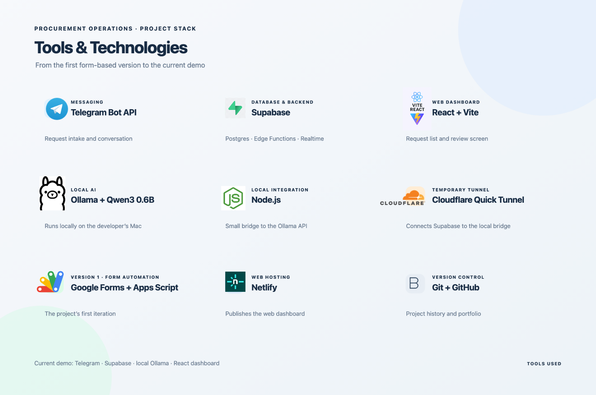

# Procurement Operations 

A personal learning project exploring how lightweight automation can make procurement requests easier to collect, organize, and review.



## Project structure

```text
procurement-web/
├── public/                  # Static files used by the website
├── src/
│   ├── lib/
│   │   └── supabaseClient.js # Browser connection to Supabase
│   ├── App.jsx               # Request dashboard and details
│   ├── App.css               # Dashboard styles
│   └── main.jsx              # React entry point
├── ollama-bridge.mjs         # Local Node.js bridge to Ollama
├── package.json              # App dependencies and commands
└── README.md
```

The Telegram webhook runs as a Supabase Edge Function and is currently managed in the Supabase Dashboard. Its source code still needs to be added to this repository to make the backend setup reproducible.

## Tools used

- **Telegram Bot API** — receives the procurement conversation.
- **Supabase** — Postgres database, Edge Function, and Realtime updates.
- **React + Vite** — web dashboard.
- **Ollama + Qwen3 0.6B** — local model that helps phrase the bot’s questions.
- **Node.js** — small local bridge between Supabase and Ollama.
- **Cloudflare Quick Tunnel** — temporary secure route to the local bridge for the demo.
- **Netlify** — hosts the web dashboard.
- **Git + GitHub** — version history and portfolio presentation.
- **Google Forms + Google Apps Script** — tools used in the first version.

## Why this project

The project is motivated by a practical opportunity: many business processes still start in chats, emails, and spreadsheets, where details can be hard to track. This demo explores one small improvement—collecting request details through a guided conversation and displaying them in one shared dashboard.

Regional data points to a wider digital adoption gap. ECLAC reported that over 60% of internet-using companies in Latin America and the Caribbean had only a passive online presence, while 70% of MSMEs in many countries had no online presence. These figures describe digital presence, not procurement workflow speed or agile-method adoption; they provide context for why practical, accessible digital tools are worth exploring. [ECLAC Digital Development Observatory](https://www.cepal.org/en/pressreleases/eclac-launched-digital-development-observatory-contribute-latin-america-and-caribbeans)

The OECD, CAF, and SELA also identify a digitalisation gap between larger companies and SMEs in Latin America and the Caribbean, and recommend stronger implementation plans and digital skills support for SMEs. [SME Policy Index: Latin America and the Caribbean 2024](https://www.oecd.org/en/publications/sme-policy-index-latin-america-and-the-caribbean-2024_ba028c1d-en/full-report/component-15.html)

## Learning goal

My main goal is to develop practical skills in **automation and operations** by building the project myself. I am learning how to map a process, collect consistent information, connect tools, store data, show its status, and improve the workflow in small steps.

## Project evolution

### Version 1 — Google Forms + Google Apps Script

The first version used Google Forms to collect information and Google Apps Script to automate basic handling. It helped me learn how a form can trigger an operational process.

### Version 2 — Telegram + Supabase + web dashboard

The second version moves the intake conversation to Telegram, stores requests in Supabase, and presents them in a React dashboard. Ollama runs locally and helps phrase the fixed questions asked by the bot.

## What the current demo does

1. A user sends `/solicitud` to the private Telegram bot.
2. The bot asks for the project, product, quantity, delivery location, and required date.
3. A Supabase Edge Function validates the Telegram webhook and processes the conversation.
4. Supabase stores the incoming Telegram message, conversation state, procurement request, and request item.
5. The web dashboard displays requests and updates when Supabase data changes.
6. A team member can open a request and mark it as reviewed.

The database has additional fields for budget and product specifications, but the current conversation does not collect all of them yet.

## How the AI fits in

Today, Ollama runs the small Qwen3 0.6B model on my Mac. The model helps phrase the bot’s next question in Spanish. The application code still controls which information is required, validates answers, and saves the request. If Ollama is unavailable, the bot can use its fixed question text.

The Ollama connection uses a local Node.js bridge and a temporary Cloudflare Quick Tunnel. The Mac, Ollama, bridge, and tunnel must be running for Telegram to use the local model.

## Future direction

The next exploration is connecting a hosted LLM such as **OpenAI** or **Google Gemini** to support a more interactive conversation. The goal is to understand a user’s request in natural language, notice which details are missing, ask useful follow-up questions, and turn the answers into structured procurement data.

The solution should stay practical: keep the request easy to complete, show the collected information for review, and leave important procurement decisions and supplier communications under human control. These LLM integrations are future work and are not currently part of the working demo.

## Demo

- **Web dashboard:** [lighthearted-crepe-5500de.netlify.app](https://solicitudesprimerdemo.netlify.app/)
- **Telegram bot:** `@soyla1bot`

This is a public demo with sample data. Do not enter real purchasing, supplier, or personal information.

## Run the dashboard locally

You need Node.js, npm, and a Supabase project configured for this app.

1. Clone the repository and open its folder.
2. Install the packages:

   ```bash
   npm install
   ```

3. Create `.env.local` in the project root:

   ```env
   VITE_SUPABASE_URL=https://YOUR_PROJECT.supabase.co
   VITE_SUPABASE_PUBLISHABLE_KEY=YOUR_PUBLISHABLE_KEY
   ```

4. Start the local dashboard:

   ```bash
   npm run dev
   ```

5. Open the local address printed by Vite, usually `http://localhost:5173/`.

Useful commands:

```bash
npm run build
npm run preview
npm run lint
```

## Safety and limitations

- The public dashboard is for sample data only; it has no sign-in screen.
- Keep database server keys, Telegram tokens, and the Ollama bridge token in the appropriate secret settings. Never commit `.env` files or put server keys in browser code.
- Review Supabase Row Level Security (RLS) policies before using real information.
- The local Ollama setup and Quick Tunnel are for learning and demos, not a permanent production hosting setup.
- RFQ or PO generation and email sending are not implemented yet.

## Possible next steps

- Add the Edge Function source and deployment instructions to this repository.
- Extend the guided questions to collect budget, condition, and technical preferences.
- Explore an OpenAI or Gemini powered conversation with structured extraction and follow-up questions.
- Add user sign-in and review database access policies before handling real data.
- Draft RFQs for human review before any supplier email is sent.
